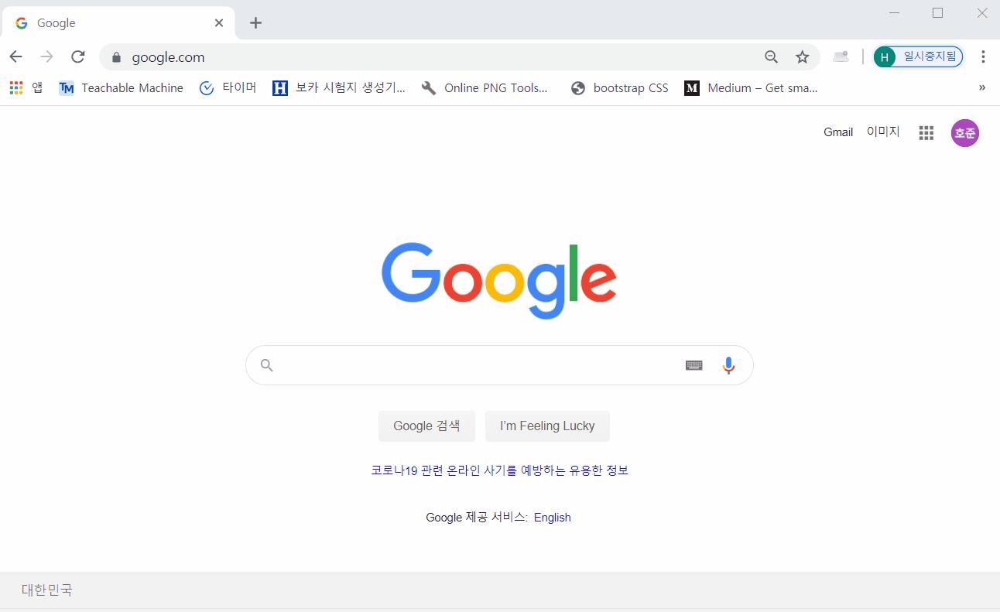

# Doongle

---

### Doongle is a local HTML page which allows three search engines(Google, Naver, Baidu) to appear in one page.

## How to install it

#### STEP.1 download [Doongle](https://github.com/jindun619/Doongle) from Github.

#### STEP.2 download [New Tab Redirect](https://chrome.google.com/webstore/detail/new-tab-redirect/icpgjfneehieebagbmdbhnlpiopdcmna) extension from Chrome Web Store.

> you should use Chrome browser

#### STEP.3 change the settings

#### STEP.4 that's all. Now you can use Doongle!

